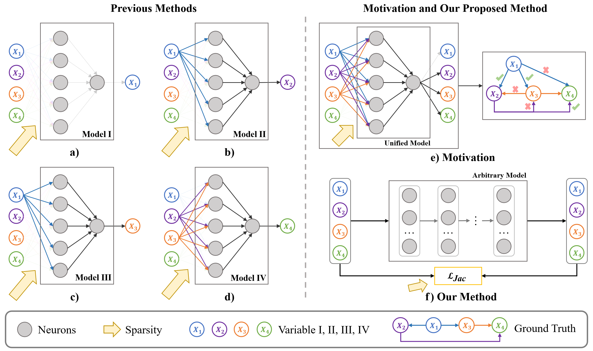

## Jacobian Regularizer-based Neural Granger Causality [[ICML 2024]](https://openreview.net/group?id=ICML.cc/2024)
Official implementation of the paper [Jacobian Regularizer-based Neural Granger Causality].
<hr />

## Highlights

> **<p align="justify"> Abstract:** *With the advancement of neural networks, diverse methods for neural Granger causality have emerged, which demonstrate proficiency in handling complex data, and nonlinear relationships. However, the existing framework of neural Granger causality has several limitations. It requires the construction of separate predictive models for each target variable, and the relationship depends on the sparsity on the weights of the first layer, resulting in challenges in effectively modeling complex relationships between variables as well as unsatisfied estimation accuracy of Granger causality. Moreover, most of them cannot grasp full-time Granger causality. To address these drawbacks, we propose a **J**acobian **R**egularizer-based **N**eural **G**ranger **C**ausality (**JRNGC**) approach, a straightforward yet highly effective method for learning multivariate summary Granger causality and full-time Granger causality by constructing a single model for all target variables. Specifically, our method eliminates the sparsity constraints of weights by leveraging an input-output Jacobian matrix regularizer, which can be subsequently represented as the weighted causal matrix in the post-hoc analysis. Extensive experiments show that our proposed approach achieves competitive performance with the state-of-the-art methods for learning summary Granger causality and full-time Granger causality while maintaining lower model complexity and high scalability.* </p>
## Main Contributions
- To our best knowledge, this is the first work to harness a single NN model with shared hidden layers for multivariate Granger causality analysis. 
- We propose a novel neural network framework to learn  Granger causality by incorporating an input-output Jacobian regularizer in the training objective. 
- Our method can not only obtain the summary Granger causality but also the full-time Granger causality.
- An efficient Jacobian regularizer algorithm is developed to solve the computational issue that occurred in ${L_1}$ loss on input-output Jacobian matrix. 
- We evaluate our method on commonly used benchmark datasets with extensive experiments. Our method can outperform state-of-the-art baselines and show an excellent ability to discover Granger causality, especially for sparse causality.
<hr />

## Performance on the benchmark datasets CausalTime

**Table**. Performance benchmarking of baseline TSCD algorithms on the CausalTime datasets. We highlight the best and the second best in bold and with underlining, respectively.
| Methods | AQI (AUROC)          | Traffic (AUROC)      | Medical (AUROC)      | AQI (AUPRC)          | Traffic (AUPRC)      | Medical (AUPRC)      |
|------------|----------------------|----------------------|----------------------|----------------------|----------------------|----------------------|
| CUTS    | 0.6013 ± 0.0038      | <u>0.6238 ± 0.0179</u>     | 0.3739 ± 0.0297      | 0.5096 ± 0.0362      | 0.1525 ± 0.0226      | 0.1537 ± 0.0039      |
| CUTS+   | <u>0.8925 ± 0.0213</u>   | 0.6175 ± 0.0752      | **0.8202 ± 0.0173**  |   <u>0.7983 ± 0.0875</u>  | **0.6367 ± 0.1197**  | 0.5481 ± 0.1349      |
| PCMCI   | 0.5272 ± 0.0744      | 0.5422 ± 0.0737      | 0.6991 ± 0.0111      | 0.6734 ± 0.0372      | 0.3474 ± 0.0581      | 0.5082 ± 0.0177      |
| NGC     | 0.7172 ± 0.0076      | 0.6032 ± 0.0056| 0.5744 ± 0.0096      | 0.7177 ± 0.0069      | 0.3583 ± 0.0495      | 0.4637 ± 0.0121      |
| NGM     | 0.6728 ± 0.0164      | 0.4660 ± 0.0144      | 0.5551 ± 0.0154      | 0.4786 ± 0.0196      | 0.2826 ± 0.0098      | 0.4697 ± 0.0166      |
| LCCM    | 0.8565 ± 0.0653| 0.5545 ± 0.0254      | <u>0.8013 ± 0.0218</u>| **0.9260 ± 0.0246**| 0.5907 ± 0.0475      | **0.7554 ± 0.0235**  |
| eSRU    | 0.8229 ± 0.0317      | 0.5987 ± 0.0192| 0.7559 ± 0.0365 | 0.7223 ± 0.0317      | 0.4886 ± 0.0338| <u>0.7352 ± 0.0600</u>|
| SCGL    | 0.4915 ± 0.0476      | 0.5927 ± 0.0553      | 0.5019 ± 0.0224      | 0.3584 ± 0.0281      | 0.4544 ± 0.0315      | 0.4833 ± 0.0185      |
| TCDF    | 0.4148 ± 0.0207      | 0.5029 ± 0.0041      | 0.6329 ± 0.0384      | 0.6527 ± 0.0087      | 0.3637 ± 0.0048      | 0.5544 ± 0.0313      |
|**JRNGC-F (ours)**   | **0.9279 ± 0.0011** | **0.7294± 0.0046** | 0.7540± 0.0040 | 0.7828± 0.0020 | <u>0.5940± 0.0067</u> | 0.7261± 0.0016


## Running the demo code 
```bash
# pip environment
   conda create -n jrngc python=3.8
   conda activate jrngc
# pip according to the requirement.txt
   pip install -r requirement.txt
# run the demo.py
   python demo.py --yaml_dir $yamlpath --data_type $data_type
```
    
**Remark**: you can also run the demo.py directly
<hr />

## Citation
If you use our work, please consider citing:
```bibtex
```
## References
[1] CausalTime: Realistically Generated Time-series for Benchmarking of Causal Discovery. *International Conference on Learning Representations (ICLR), 2024